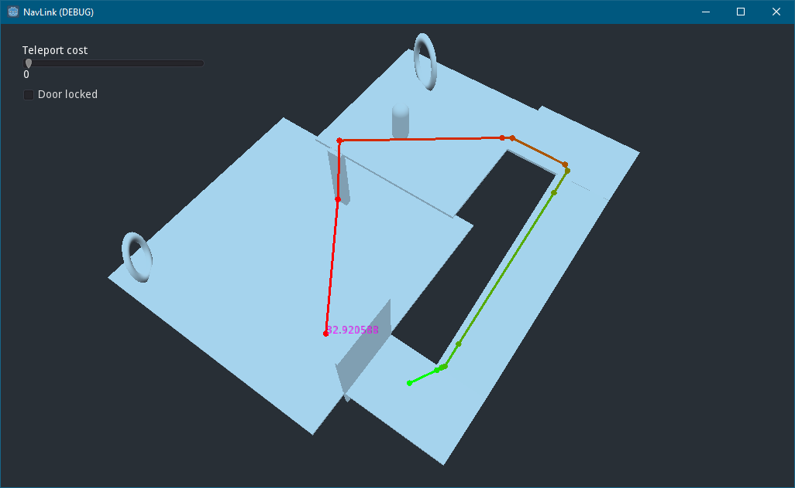

# Godot NavLink addon
Navigation links for Godot engine allow stairs, one way doors and teleports when using build-in baked navigation mesh.
This addon is designed for Godot 3.2.3

This addon is a WIP so you might run into some problems.



------

## Install
- Copy [addons/NavLink](addons/NavLink) folder to your project's addons folder.
- Enable the addon in your project settings.

------

## How to use
To start with I'd recommend playing around in the Main.tscn scene and clicking around.

To use NavLinks in your project you'll need to use "NavLinkNavigation" which will completely replace the usual "Navigation" node in your scene tree. Start by adding the "NavLinkNavigation" to your scene via "Add Child Node" and use it like normal "Navigation" node and build your navmesh.

To add a link:
- Right click on any node on your node tree and click on "Add Child Node", the link can be in a sub-scene.
- Search and add NavLinkPath.
- Modify the NavLinkPath object start and end positions. To make 2 way links, you'll have to use 2 overlapping links going the other way. The link start and end positions should be no farther than 0.5 units away from the generated (baked) navmesh.

Use `get_nav_link_path()` (`get_simple_path()` is available also) to get the path navigated via the navigation links.

`get_nav_link_path()` Parameters are defined as:
```
from_position:Vector3,
to_position:Vector3,
agent_tags:PoolStringArray = [],
agent_width:float = 1.0
```

`get_nav_link_path()` returns a dictionary that looks like this:
```
(as a Dictionary) {
"type": path_type (either PATH_TYPE.SIMPLE or PATH_TYPE.NAV_LINK_PATH),
"complete_cost": float: (total path cost),
"complete_path": PoolVector3Array: (positions of the entire final path),
"nav_link_to_first": PoolVector3Array: (positions leading to the first NavLinkPath node),
"nav_link_to_first_cost": float: (cost of the route to the first NavLinkPath object),
"nav_link_from_last": PoolVector3Array: (positions leading from last NavLinkPath to final position),
"nav_link_from_last_cost": float: (cost of the route from last NavLinkPath object to the final position),
"nav_link_path_nodes": Array: (NavLinkPath objects in order of appearance),
"nav_link_path_node_cost": PoolRealArray: (per NavLinkPath cost as floats),
"nav_link_path_inbetween": [PoolVector3Array]: (array of regular paths in-between NavLinkPath objects, as array of positions),
"nav_link_path_inbetween_costs": PoolRealArray: (tells the costs for paths in-between NavLinkPath objects)
}
```

NavLinkPath objects also have some properties you can adjust during runtime, such as cost, tags and how many tags are required and agent width.

Cost is just the navigation cost of taking this specific link, if the cost is low, then taking the link is favored, if the cost is high then the link is less likely to be taken. Cost is multiplied by the distance of the link start and end positions when solving the NavLink path.

Tags are like keys and locks on doors, if the link has any tags then the agent must have those tags in order to use that link. Each link can have multiple tags of which either one or all are needed to pass through it, this setting can be changed in editor or runtime as well.

Agent width is an additional condition for the agent. Agent width must be smaller than the link's width in order to pass through it.

## License
Copyright (c) 2021 Niko Kauppi (Noxagonal) Noxagonal@gmail.com

This software is released under [MIT license](LICENSE.md)
